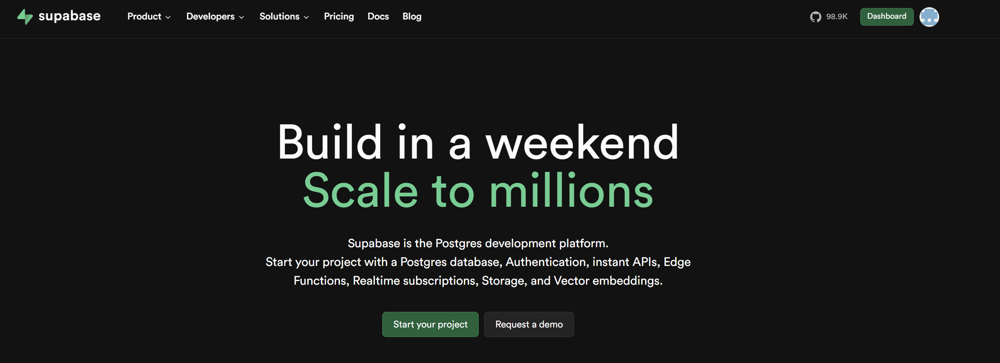
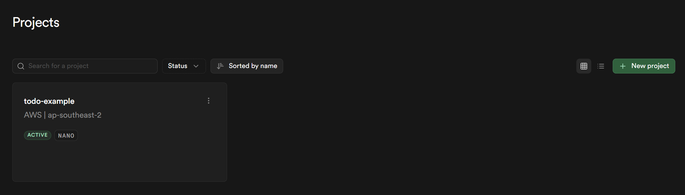

# 8주차 - Supabase 3: JavaScript 연결

## 학습 목표

- Supabase `Project URL`과 `anon public key`가 왜 필요한지 이해한다.
- JavaScript 코드에서 Supabase 클라이언트를 만드는 흐름을 읽을 수 있다.
- 데이터 조회와 추가의 흐름을 구분할 수 있다.

## 코드를 쓰기 전에 먼저 해야 할 일

이 수업은 코드만 보고 따라갈 수 없습니다. 학생이 Supabase 대시보드에서 프로젝트와 테이블을 먼저 준비해야 합니다.

### 1. 프로젝트 생성


<br>

<br><br>

1. Supabase에 로그인합니다.
2. `New project`를 클릭합니다.
3. 프로젝트 이름, 데이터베이스 비밀번호, 리전을 설정합니다.
4. 프로젝트 생성이 완료될 때까지 기다립니다.

### 2. 테이블 생성

이 수업은 `todo` 테이블을 기준으로 설명합니다.

필수 컬럼은 아래와 같습니다.

- `id`
- `content`
- `is_done`
- `created_at`

학생은 `Table Editor`에서 직접 만들거나, `SQL Editor`에서 아래 SQL을 실행할 수 있습니다.

```sql
create table if not exists public.todo (
  id bigint generated by default as identity primary key,
  content text not null,
  is_done boolean not null default false,
  created_at timestamptz not null default now()
);
```

### 3. API 값 확인

`Settings > API`에서 아래 값을 찾습니다.

- `Project URL`
- `anon public key`

중요:

- 브라우저 JavaScript에서는 `anon public key`를 사용합니다.
- `service_role` 키는 프론트엔드용이 아닙니다.

## 준비물

- Supabase `Project URL`
- Supabase `anon public key`
- `08-supabase/example/guestbook-app/script.js`

## 이번 주 파일 설명

- `08-supabase/example/guestbook-app/script.js`: 조회와 추가가 구현된 완성 예제
- `08-supabase/starter/supabase-connection-practice/script.js`: 학생이 TODO를 채우는 starter 파일

## 코드에서 볼 부분

- `createClient()`: Supabase 클라이언트를 생성합니다.
- `.from("todo")`: 사용할 테이블을 지정합니다.
- `.select(...)`: 데이터를 조회합니다.
- `.insert(...)`: 데이터를 추가합니다.

## 실습 순서

1. Supabase 프로젝트를 생성합니다.
2. `todo` 테이블을 생성합니다.
3. `Settings > API`에서 `Project URL`과 `anon public key`를 확인합니다.
4. 클라이언트 생성 코드를 읽습니다.
5. 조회 흐름과 추가 흐름을 구분해 봅니다.
6. 조회한 데이터가 화면에 어떻게 보이는지 확인합니다.

## 학생 미션

1. 조회 코드와 추가 코드의 차이를 설명해 봅니다.
2. `.from("todo")`가 무엇을 의미하는지 설명해 봅니다.
3. starter의 TODO를 보고 어떤 기능이 빠져 있는지 예측해 봅니다.

## 체크리스트

- [ ] `Project URL`이 어디에 있는지 안다.
- [ ] `anon public key`가 어디에 있는지 안다.
- [ ] 이 코드가 어떤 테이블을 사용하는지 안다.
- [ ] 조회와 추가의 차이를 설명할 수 있다.

## 자주 하는 실수

- 프로젝트만 만들고 테이블은 만들지 않은 경우
- 잘못된 키를 복사한 경우
- `service_role` 키를 프론트엔드 코드에 넣은 경우
- 테이블 이름을 다르게 쓴 경우
- 코드가 기대하는 컬럼 이름과 실제 컬럼 이름이 다른 경우

## 정리

Supabase 연결 코드는 대시보드 설정이 먼저 끝나야 정상 동작합니다. 학생은 프로젝트, 스키마, API 값을 먼저 준비한 뒤에 JavaScript 예제를 실행해야 합니다.
